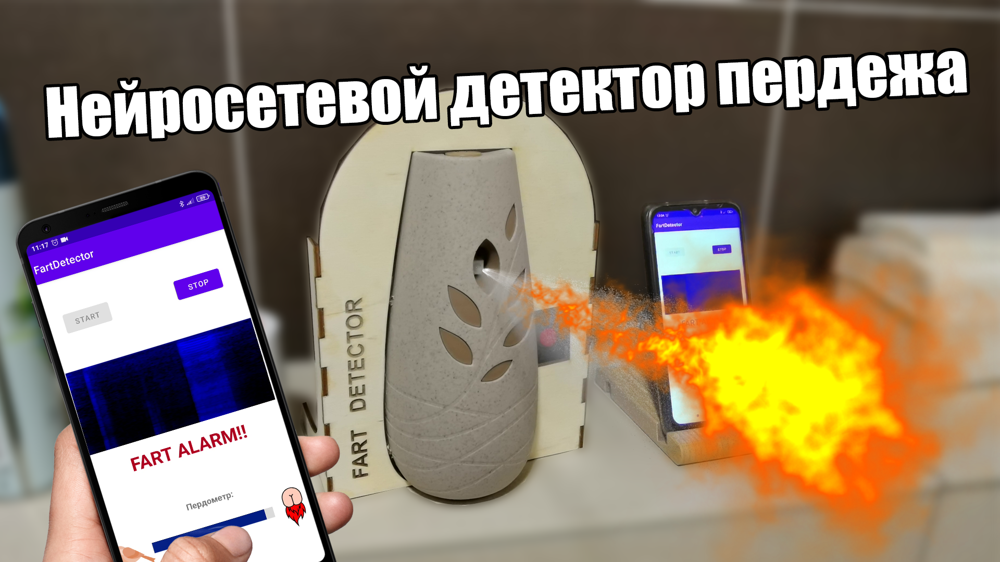

## Fart detector

Данный репозиторий содержит всё необходимое для того чтобы самому собрать автоматический освежитель воздуха, реагирующий на звуковые события.

### Ссылка на YouTube видео: https://www.youtube.com/watch?v=zE5qQ1LDb7s

### Структура репозитория:

* **arduino** - исходный код прошивки для Arduino nano
* **body** - все чертежи и модели для 3D печати, чтобы изготовить корпус детектора
* **electronic circuit** - электронные схемы и разметка печатных плат
* **mobile** - исходный код мобильного приложения на Java. В данной программе используется [JLibrosa](https://github.com/Subtitle-Synchronizer/jlibrosa) для работы со спектрограммами
* **neural network** - Jupyter ноутбуки для обучения детекции звуковых событий